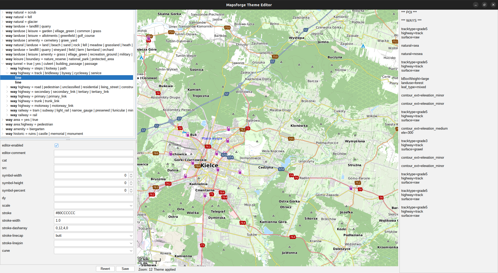
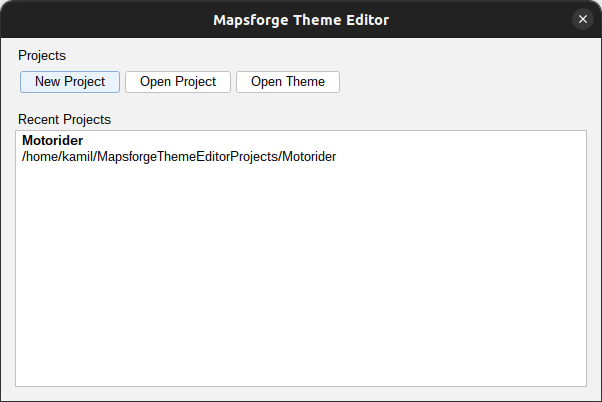

# Mapsforge Theme Editor

- [Features](#features)
- [Usage](#usage)
- [License](#license)
- [Screenshots](#screenshots)
  
## Features
- Visual editor for Mapsforge RenderTheme XML files.
- Live preview of the theme on a map.
- Support for various Mapsforge features including styles, rules, and symbol definitions.
- Auto-saving theme in Mapsforge XML format.
- User-friendly interface for easy theme creation and modification.
- Drag and drop, change order, enable/disable rules and draw instructions.
- Add comment to describe rule or draw instruction.

## Usage
- install JDK:  
`sudo apt install openjdk-17-jdk**`
- run with:  
`java -jar mapsforge-theme-editor.jar`
- Create empty project, open existing project or create a project from existing theme.

Existing theme files will not be overwritten, editor will create a new theme.xml file in the same directory.

## License

Mapsforge Theme Editor is under [LGPL v3 license](http://www.gnu.org/licenses/lgpl-3.0), with an important simplification: the constraints mentioned in sections LGPL v3 §4(d) and §4(e) are waived.

This means that you are allowed to convey a Combined Work without providing the user any way to recombine or relink the application and without providing any shared library mechanism.

In other words, you are allowed to include Mapsforge Theme Editor in your application, without making your application open source.

## Screenshots

